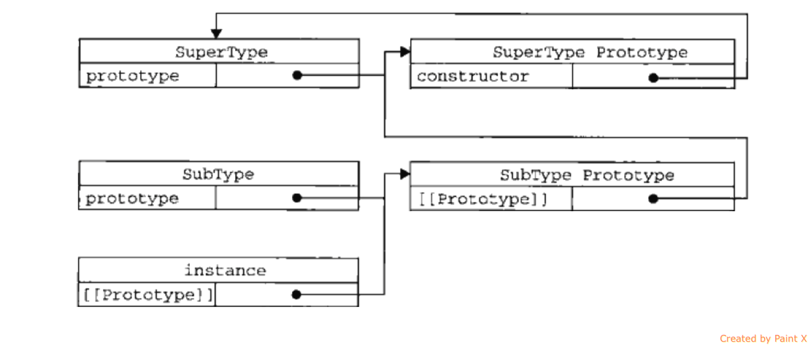

## js基础知识

js资料:

[You don't know js](https://github.com/getify/You-Dont-Know-JS)

### prototype 与\__proto__
两者都是指向原型，不同点是，prototype是在类中使用，\__proto__是在实例中使用，可能叙述的不太严谨，看个例子就明白了：

```
function Person(){}

Person.prototype === new Person().__proto__; //true
new Person().prototype === undefined; //true
```


---

### instanceof的原理
`obj instance clazz`如果为true，那么在obj的原型链中一定能找到一个指针，指向 clazz的构造函数。
举个例子 ：
```js
function SuperType(name){
    this.name = name;
}

function SubType(){

}
//思考： 为什么不是SubType.prototype = SuperType
SubType.prototype = new SuperType();

new SubType() instanceof SuperType //true
new SubType() instanceof SubType //true
```

我们来看一下它们的一个关系



### new 指令做了什么事情
根据[MDN](https://developer.mozilla.org/en-US/docs/Web/JavaScript/Reference/Operators/new)的解释： 
> When the code new Foo(...) is executed, the following things happen:
> 
> 1.A new object is created, inheriting from Foo.prototype.
> 
> 2.The constructor function Foo is called with the specified arguments, and with this bound to the newly created object. new Foo is equivalent to new Foo(), i.e. if no argument list is specified, Foo is called without arguments.
> 
> 3.The object returned by the constructor function becomes the result of the whole new expression. If the constructor function doesn't explicitly return an object, the object created in step 1 is used instead. (Normally constructors don't return a value, but they can choose to do so if they want to override the normal object creation process.)
> 


按照上面所说的，我们来实现一个new的操作：
```js
function newObj(func, args){
    var temp = Object.create(func.prototype);
    var res = func.apply(temp, args);
    //如果res非空，则返回res
    return res && typeof res === 'object' ? res: temp;
}

function Foo(name){
    this.name = name;
}

var foo1 = new Foo('zhangsan');
var foo2 = newObj(Foo, ['lisi']);

console.log(foo1.name);  //zhangsan
console.log(foo2.name); //lisi
console.log(foo1.__proto__ === foo2.__proto__); //true

```

从上面的例子可以看出， newObj函数和new的效果是等价的， 其实，javascript已经为我们内置了一个同样功能的函数： `Reflect.construct`, 它的作用和`new`操作符是一样的，详细的用法请参见[MDN](https://developer.mozilla.org/en-US/docs/Web/JavaScript/Reference/Global_Objects/Reflect/construct)

>Tips: 上面的3中说的构造函数中有return，那么什么时候会有这种场景呢？
> 
> - 要构造单例模式
> 
> - 想让 `Foo()` 和 `new Foo()`返回同样的值的时候。


